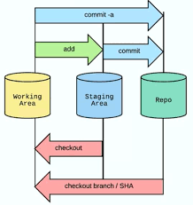

# Working Area, Staging Area, Repository

## Working Area

* The files in your working area that are also not in the staging are not handled by git
* Also called **untracked files**

## Staging Area

* What files are going to be part of the next commit
* The staging area is how git knows what will change between the current commit and the next commit

**Moving files in & out the staging area:**

* **add** a file to the next commit

```text
git add <file>
```


**Git add -p** allows to stage commits in hunks


```text
git add -p

?
```

* delete a file in the next commit

```text
git rm <file>
```

* **rename** a file in the next commit

```text
git mv <file>
```


## Repository

* contains all your commits



